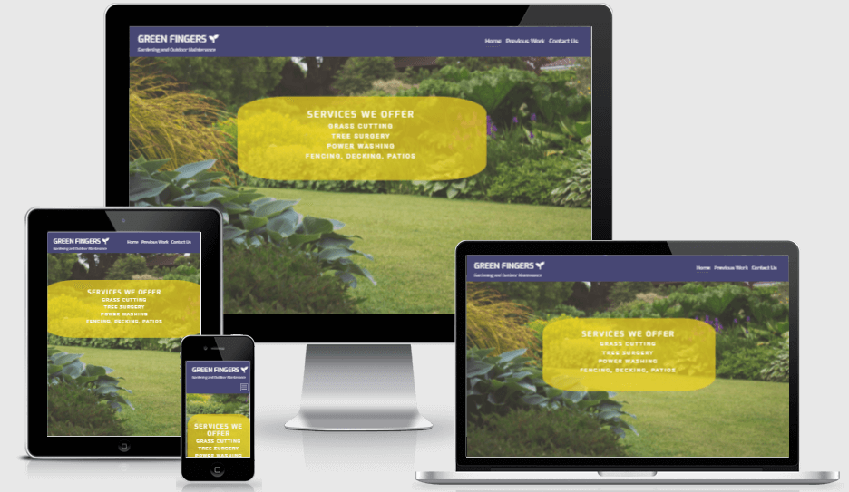
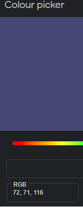
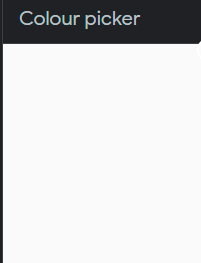
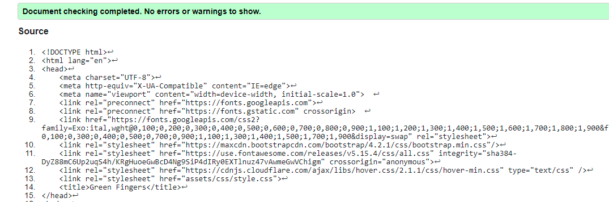
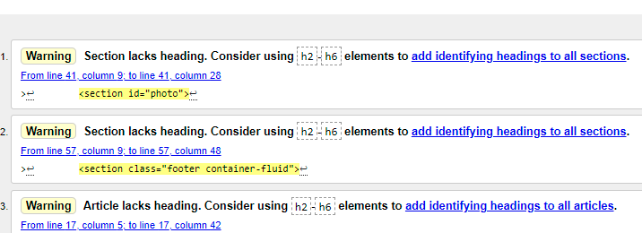
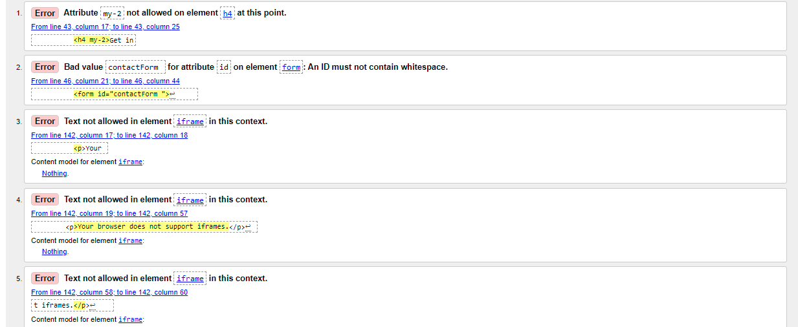
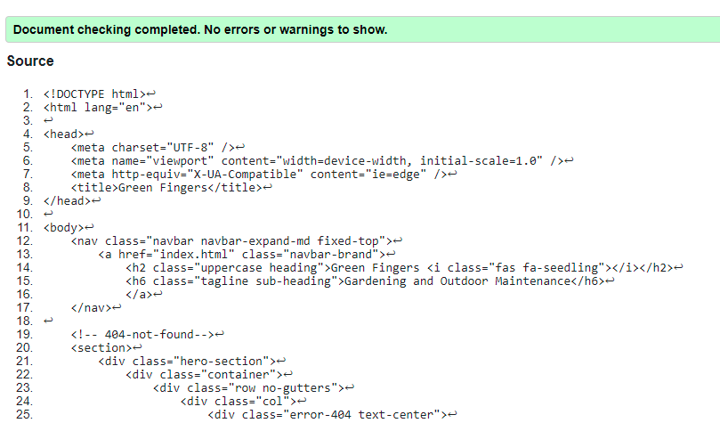
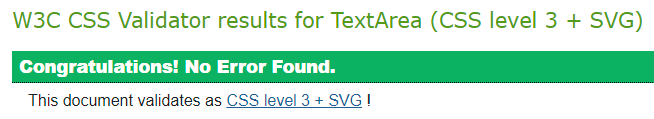

# Green Fingers
## Gardening and Outdoor Maintenance Services

## About

**Green Fingers** is a ficticious gardening and outdoor maintenance company who require a B2C website to promote their services. 
The sight is designed to inform potential users and customers of the services they provide and to showcase their previous work which is of high quality tradesmanship. The website also aims to prompt the user to contact the business with a 'Call to Action' form on the 'Contact Us' page. 

The site is designed to look professional, but avoid a corporate appearance, given that the target user is private home owners, potentially young working professionals, who are time poor and who have disposable income. The website is responsive and accessible on a range of devices to ensure maximum user experience regardless of the device they are using.

[Green Fingers Site](https://paddyd101.github.io/GreenFingersMs1/index.html)

## **Contents**

- [**UX (User Experience)**](#ux-user-experience)
  - [**User Stories**](#user-stories)
  - [**Site Owner Goals**](#site-owner-goals)
- [**Design**](#design)
  - [**Fonts**](#fonts)
  - [**Colours**](#colours)
  - [**Images**](#images)
  - [**Wireframes**](#wireframes)
- [**Technologies Used**](#technologies-used)
  - [**Languages**](#languages)
  - [**Libraries**](#libraries)
  - [**Other Tools**](#other-tools)
- [**Features**](#features)
  - [**Future Developments**](#future-developments)
- [**Version Control**](#version-control)
- [**Testing**](#testing)
- [**Bugs**](#bugs)
- [**Deployment**](#deployment)
- [**Credits**](#credits)

## **UX (User Experience)**

### **User Stories**
- As a user visiting the site for the first time:
  - I want to be able to understand the purpose of the website very quickly upin arrival to the site. 
  - I want to be able to see the services that the company offer 
  - I want to be able to see social media links so that I can keep up to date through Facebook, Instagram and Twitter.
  - I want a clear navigation menu which allows intuitive navigation of the site for a maximum user experience.  
  - I want to see examples of work previously carried out by the company
  - I want to see testimonials from the company's previous customers
  - I want to clearly see the contact details, hours of work and location of the business.  
  

- As a user returning to the site:
  - I want to see up to date testimonials and examples of recetn work that has been done. 
  - I want to be able to view the site on a variety of devices.

### **Site Owner Goals** 
- As a site owner I want the site to showcase the quality of the company's work.
- As a site owner I want the website to have a professional, yet friendly and inviting appearance to encourage potential users and cutomners to get in comtact.
- As a site owner I want the user to be aware of the various social media platforms that the company are active on in order to grow a prescence on social media.
- As a site owner I want to create a website which informs the user of the services offered by the company and the geographical locations serviced.
- As a site owner I want a website which is easy and fun to navigate for the user, to maximise user experience and to encourage the user to return to the site, and avail of our services

[Back to contents](#contents)

## **Design**

### **Fonts**

This site was designed using the [Exo](https://fonts.google.com/specimen/Exo) and [Roboto](https://fonts.google.com/specimen/Roboto) fonts from [Google Fonts](https://fonts.google.com/). These particular fonts are clear, legible and professional.  

### **Colours**

The target user of the site is someone who has a garden which requires some degree of managing. Gardens reprersent life and vibrance and with that a bright and vibrant color scheme was chosen alongside images of the same nature.

The colour selected for the navigation bar and the footer was a deep purple with RGB value 72,71,116

To contrast this, a font colour of hexidecimal #fafafa, an off-white colour was chosen for the text.

Format: [CSSgenerator.org Colour Picker](https://cssgenerator.org/rgba-and-hex-color-generator.html)

### **Images**

It was important for the site to be visually appealling. Choosing vibrant, and striking images was paramount. All of the images were sourced (with thanks) from [Pexels.com](https://www.pexels.com/) and free to use with appropriate acknolwedgment.  

### **Wireframes**

The wireframes were created using [Balsamiq](https://balsamiq.com/) and can be found in png format in [wireframes](assets/wireframes)

- [Home](assets/wireframes/homepage/index.png)
- [Contact Us](assets/wireframes/contact/contact.png)
- [Previous Work](assets/wireframes/previousWork/previousWork.png)

[Back to contents](#contents)

## **Technologies Used**

### **Langauges**

- [HTML5](https://developer.mozilla.org/en-US/docs/Web/HTML)
  - Hypertext markup language for the website content.
- [CSS3](https://developer.mozilla.org/en-US/docs/Web/CSS)
  - Cascading Style Sheets, used to style the website.

### **Libraries**

-[Bootstrap](https://getbootstrap.com/)  
  - Utilised for its grid layout, form and modal components.

### **Other Tools**

- [GitHub](https://github.com/)
  - Used for version control and saving current work to git hub repository. Git hib was also used to deploy the live website on github pages.
- [Gitpod](https://www.gitpod.io/)
  - An Integrated Developement Envirmonment from the creators of VS code. All current work was merged to the main repository on github.
- [Code Institute Full-Template](https://github.com/Code-Institute-Org/gitpod-full-template)
  - A blank template for creating web pages, hosted on and forked from github.
- [Font-Awesome](https://fontawesome.com/icons?d=gallery)
  - Used to include icons  throughout the website
- [Google fonts](https://fonts.google.com/)
  - Used for font selection
- [CSSgenerator.org Colour Picker](https://cssgenerator.org/rgba-and-hex-color-generator.html)
  - Used to choose the colour scheme by visualising complimentary colours
- [Lighthouse](https://developers.google.com/web/tools/lighthouse)
  - Used to assess sight performance.
- [WebPageTest](https://www.webpagetest.org/)
  - Used to further test site performance.
- [amiresponsive](http://ami.responsivedesign.is/)
  - A tool used to check how responsive the site is on different devices.
- [tinyjpg.com](https://tinyjpg.com/)
  - used to compress image sizes to optimize site performance 

[Back to contents](#contents)

## **Features**

Features consistent throughout the site:
- **Header**
    - Fixed header, contains navigation links to maximise ease of site navigation.
    - The current page or 'Active' page is highlited with an underline to improve user orientation
    - Order of navigation links are consistent with standard navigation order convention
    - On mobile and tablet view the Navigation links collapse in to a 'hamburger icon' as this requires less screen real estate and improves user experience.

- **Hero Image**
    - The main site image is displayed within a full width container. Keyframe animations (inspiration from code institutes 'Love Running' project) were ussed to maximise the initial impact for the user. 
  
- **Footer** 
    - Predictably positioned at the bottom of each page.
    - Contains additional site navigation links with icons and social media links.

  
#### *index.html*
  
- **Services Offered**
   - Text overlay of the hero image with rgba value of 0.7 to allow some translucency.

- **Areas Covered by the Service Provider**
   - Informative for the site user

  **Insurance**
    - The company's credentials are listed to customer reassurance

- **Testimonials**
    - Customer feeback accompanied by an image of the work done with some animations on mouse hove to draw attention to the static webpage. 
    
#### *history.html*

- A tiled image gallery of some of the work performed by the company.
- Inspiration taken from the 'Love Running' project, with further features to make the images more appealing and interactive on 'mouse hover' 

#### *contact.html*

- **Contact form**
    - An inviting contact form for the user to easily contact the business. The input fields are set to require user details to be entered.

- **Modal**
    - Bootstrap's Modal was implemented to provide the user with information that the form has been submitted.

- **Buttons** 
   - Simple informative and intuitive buttons invite the user to submit the form or reset the details

#### *404.html*

 - **Button**
    - The 404.html page contains a button which redirects to index.html. This eliminates the need for the user to navigate using the 'back button'. 

### **Future Developments**
- Further development would involve ensuring that the modal on the contact form only displayed when all of the fields were populated and submitted. Some research into this functinality suggests that Javascript col dbe utilised for this purpose. This will be rectified by the developer later in the course.
- I would like to implement an appointment booking system and for the user to receive feedback of appointment booked via email and sms.
- I would also like to add an option for the user to add a testimonial to the business online and link to Trust Pilot
- I would like to include a Facebook messenger 'chat box' facility so that the site user can communicate directly with the business in real time.

## **Version Control**

### Gitpod Workspaces
The [Code Institute's template](https://github.com/Code-Institute-Org/gitpod-full-template) was cloned by clicking **Use this template** and creating a version of the template in the developers github repository. Once in the developers repository, a workspace was launched in gitpod by clicking **Gitpod**.
The gitpod workspace was automatically created and rendered.

### git commit and git push
The developer endeavoured to commit changes to the code regularly. A general rule of thumb was to commit after the completing any completed section of code. Once **committed**,  **git push** was used to commit the changes back to the main remote repository on github. Meaningful commit messages were included on each commit. 

[Back to contents](#contents)

## **Testing**

### **Function Testing**

Testing was performed on Google Chrome and utilised chrome developer tools. 

- Navigation bar
  1. Business name/logo is navigates to the homepage from all pages.
  2. Each Link takes the user to the desired destination.
  3. The 'hamburger icon' appears on medium and smaller devices.
  4. Navigation bar remains at the top of the browser on all devices.
  5. Tested on different devices with 'devtools' 

- Footer 
  1. Scroll to the bottom of the page.
  2. Consitent throughout the website. 
  3. Social media links open respective social media platforms in a new tab using target="_blank".
  4. Tested on different devices with 'devtools' 

- Contact form 
  1. Email feild prompts for valid email address.
  2. Telephone feild prompts for valid telephone number 11 digits long.
  3. Tested on different devices with 'devtools' 

- Modal
  1. Modal Appears on form submission.
  2. Modal shows only when all required fields correctly filled // Requires further developement.
  3. Close button works as required.

### **User Story Testing**

- As a user visiting the site for the first time:
  - [x]I want to be able to understand the purpose of the website very quickly upin arrival to the site. 
  - [x]I want to be able to see the services that the company offer 
  - [x]I want to be able to see social media links so that I can keep up to date through Facebook, Instagram and Twitter.
  - [x]I want a clear navigation menu which allows intuitive navigation of the site for a maximum user experience.  
  - [x]I want to see examples of work previously carried out by the company
  - [x]I want to see testimonials from the company's previous customers
  - [x]I want to clearly see the contact details, hours of work and location of the business.
  
- As a user returning to the site:
  - [x]I want to see up to date testimonials and examples of recent work that has been done. 
  - [x]I want to be able to view the site on a variety of devices.

### **Site Owner Goals** 
- [x]As a site owner I want the site to showcase the quality of the company's work.
- [x]As a site owner I want the website to have a professional, yet friendly and inviting appearance to encourage potential users and cutomners to get in comtact.
- [x]As a site owner I want the user to be aware of the various social media platforms that the company are active on in order to grow a prescence on social media.
- [x]As a site owner I want to create a website which informs the user of the services offered by the company and the geographical locations serviced.
- [x]As a site owner I want a website which is easy and fun to navigate for the user, to maximise user experience and to encourage the user to return to the site, and avail of our services.

### **Performance Testing**
- [WebPageTest](https://www.webpagetest.org/), Ireland, browser Chrome highligted a 'security' score of E and a 'Cache static content' of D. The developer will consider reviewing these following further education.
  
- [Lighthouse Report Result](assets)
  -Main issues to bring down the performance score were things outwith my control - eg. Bootstrap links (error unused CSS) and caching issues (requesting http cache-control)

### **Responsive**
The site is responsive on all screen sizes. This was achieved using the bootstrap framework and CSS media queries.

### **W3C Validator**

**index.html**

See [bugs](#bugs)

[Back to contents](#contents)

## **Bugs**

- Error: Attribute my-2 not allowed on element h4 at this point.
  - my-2 class removed

- Error: Bad value "contactForm " for attribute id on element form: An ID must not contain whitespace.
  - white space removed after contactForm

- Error: Text not allowed in element iframe in this context.
  - 

 not permitted in iframe

[Back to contents](#contents)

## **Deployment**

The website was deployed to **GitHub Pages**.
1. Select **Paddyd101/GreenFingersMs1**.
3. Select **Settings**
4. Select **Pages**.
4. Under **Source** select **Main** and then **root**.
5. The site is deployed on: https://paddyd101.github.io/GreenFingersMs1/

### How to contribute

1. Login to [GitHub](https://github.com/)
2. GreenFingersMs1 [repo](https://paddyd101.github.io/GreenFingersMs1)
3. Click **Fork**
4. Select [GitPod](https://gitpod.io/) from your own forked version of the repository.
5.  Add, commit and push changes back to your to your own [GitHub](https://github.com/)
6. Create a Pull Request (PR).

### Run the project locally

1. [GitHub Repository](https://github.com/suzybee1987/ms1-ali-shiatsu)
2. Above the files click the **code** button and copy the HTTPS or SSH code.
3. To clone using HTTPS click the clipboard symbol under "Clone with HTTPS". 
4. Open Git Bash
5. Navigate to your desired working directory.
6. Type 'git clone' followed by the url copied from step 3. 
7. Press 'enter' to create your clone.
8. Use git checkout -b "..branchName.." to rename your local branch

[Back to contents](#contents)

## **Credits**

- CodeInstitute Full Stack Developer Course

### **Content**

- README.md guidance from:
  - [Code Institute SampleREADME.md](https://github.com/Code-Institute-Solutions/SampleREADME)
  - Credit to sample of layout from CIs [suzybee1987](https://github.com/suzybee1987/ms1-ali-shiatsu/blob/master/README.md) 

  
### **Layout**

- Code Institutes Anna Greaves [youtube](https://www.youtube.com/watch?v=zDpCejbl1sU&t=9s) video on bootstrap containers

### **Images**

- All images were sourced on the pexels.com website and can be found [here](https://www.pexels.com/search/garden/)

[Back to contents](#contents)

